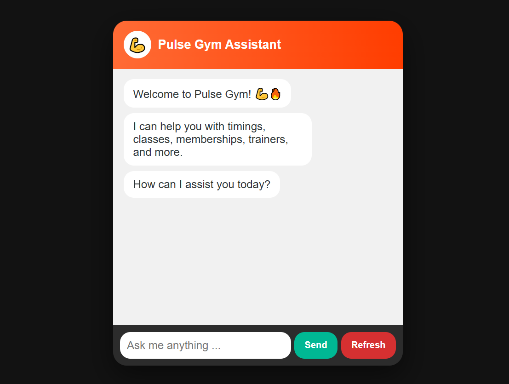
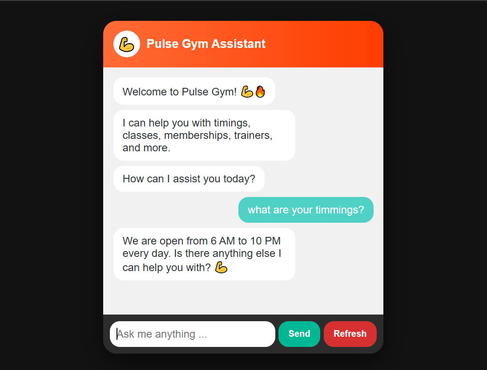
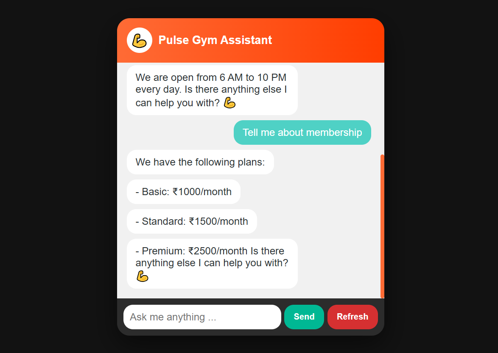
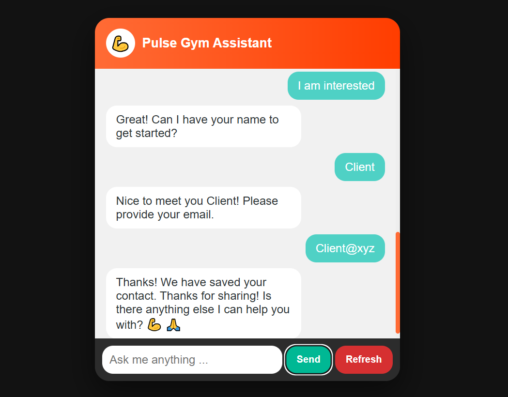

# 💪 LeadPulse AI - Smart Business Chatbot

A fast, lightweight AI chatbot that helps businesses automatically answer customer queries and capture leads (name & email) in real-time.

🌐 **Live Demo:** https://shaibansufi.github.io/pulse-gym-chatbot/  
⚙️ **Backend API:** https://pulse-gym-chatbot.onrender.com  

---

## 🚀 Features

- 💬 Instant replies to customer questions  
- 🧠 Smart keyword-based understanding  
- 📊 Automatic lead capture (saved in CSV)  
- ⚡ Fast and lightweight (no external API)  
- 🌐 Fully deployable for free  
- 🎯 Works for any business (gym, clinic, coaching, etc.)

---

## 📸 Demo Screenshots

> Place your screenshots inside the `demo/` folder in your repo.

### 🟢 Chat Interface

### 🟢 Bot Response For Timming

### 🟢 Bot Responses For Membership

### 🟢 Lead Capture

---

## 🛠️ Tech Stack

- Python (Flask)
- Flask-CORS
- HTML, CSS, JavaScript
- CSV (for lead storage)

---

## 📂 Project Structure

pulse-gym-chatbot/
│
├── app.py
├── leads.csv
├── requirements.txt
│
├── index.html
├── styles.css
│
├── demo/ # Screenshots folder
│ ├── Introduction.png
│ ├── Timming.png
│ ├── Membership.png
│ ├── Leads.png
└── README.md

---

## ⚙️ Run Locally

1. Clone the repo:

git clone https://github.com/yourusername/pulse-gym-chatbot.git

cd pulse-gym-chatbot

2. Install dependencies:

pip install -r requirements.txt

3. Run backend:

python app.py

4. Open frontend:
- Open `index.html` in browser  
OR  
- Use VS Code Live Server  

---

## 🌐 Deployment (Free)

### Backend (Render)
- Build Command:

pip install -r requirements.txt

- Start Command:

python app.py

### Frontend (GitHub Pages)
- Enable GitHub Pages in repo settings  
- Keep `index.html` in root  
- Update API URL:

https://pulse-gym-chatbot.onrender.com/chat

---

## 💡 How It Works

1. User asks a question  
2. Bot replies instantly  
3. If user shows interest → asks for:
   - Name  
   - Email  
4. Data saved in `leads.csv`

---

## 🎯 Demo Questions

- What are your timings?
- Membership plans?
- Do you have trainers?
- I am interested

---

## 📈 Use Cases

- Gyms  
- Clinics  
- Coaching centers  
- Salons  
- Local businesses  

---

## 🤝 Author

Shaiban Shaikh

---

## ⭐ Note

This project demonstrates how businesses can automate customer support and generate 
